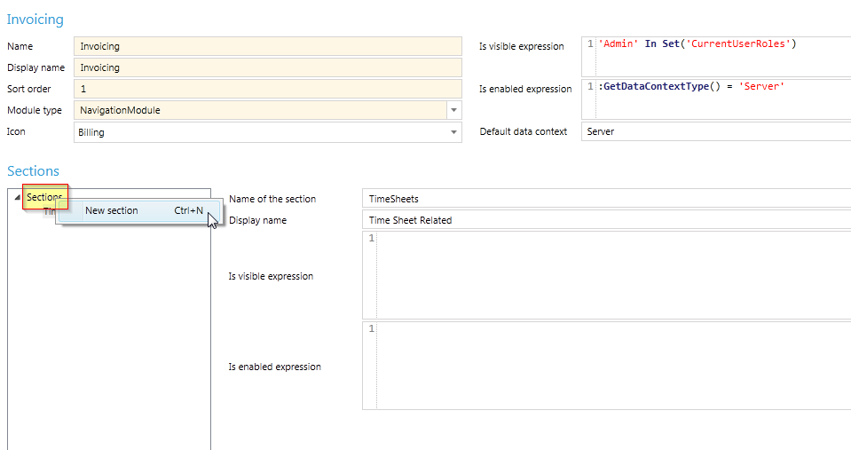
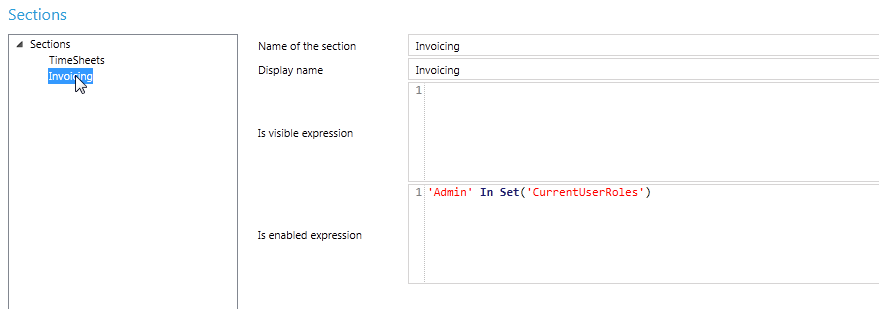
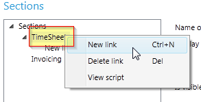
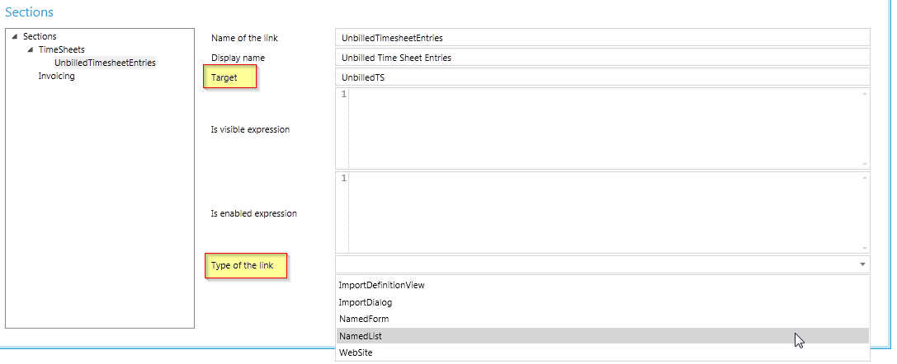
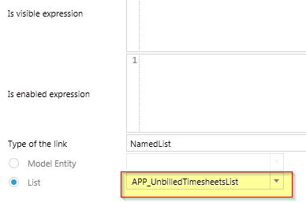
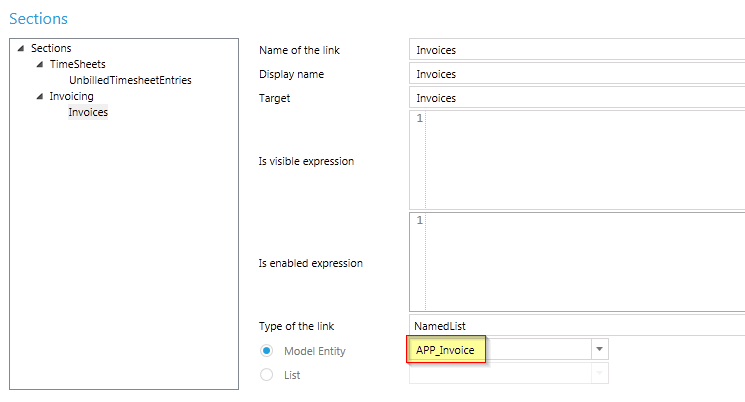
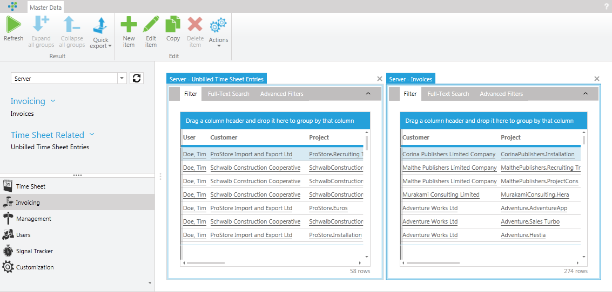
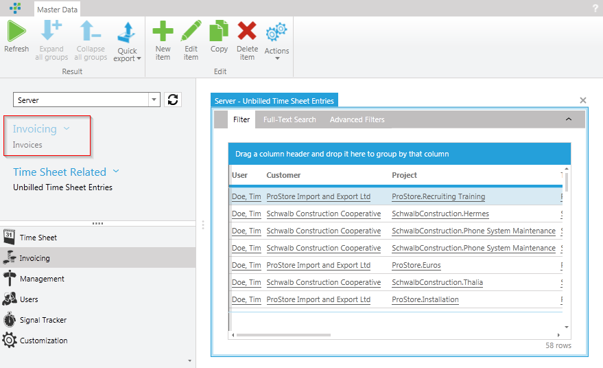

# Navigation	

This chapter describes how you can define your own modules, sections and links in time cockpit to better structure your customization.

time cockpit allows you to create your own custom lists. To make those custom lists available for users, you can create your own menu where you can link your lists. For defining hierarchical menus, time cockpit provides three levels, namely modules, sections and links.

## Modules

The highest level of a menu in time cockpit is a module. Modules are situated in the left hand corner of time cockpit. Out of the box, time cockpit comes with 5 pre-defined modules. The Time Sheet module holds the time sheet calendar. The Management module lets users manage their master data. The Users module subsumes all user-related information and the Signal Tracker lets users configure their trackers. If you have the administrator role in time cockpit you will also see the Customization module.


Modules can be created in the Customization module. In the following we only show to create the most common type of modules, a Navigation Module. In a Navigation Module you can define links to lists to navigate through for example your master data. In the following we will define a dedicated module for Invoicing.


To create a new module go to the Customization module, change to Server and click New module according to the latter figure. A module has four mandatory fields:

Field | Description
--- | ---
Name |The technical name of the module. This name needs to be unique.
Display name | The name that is shown in the UI.
Sort order | The sort order determines in which order the modules are shown in the lower left corner.
Module type | Determines the type of the module. In this topic we create a Navigation Module only.

The above fields need to have a value to be able to save the module. Additionally you can configure the following fields:

Field | Description
--- | ---
Icon | Out of the box, time cockpit provides a predefined set of icons for your module. The icon you choose will appear beside the display name of your module in the lower left corner of time cockpit. For our Invoicing module we choose the Billing icon.
Is visible expression | With the Is visible expression you can control for example which users are allowed to see the module. If you like to hide the Invoicing module from other users than admins and back office personnel you can define the following Is visible expression: `'Admin' In Set('CurrentUserRoles') Or 'BackOffice' In Set('CurrentUserRoles')`. Is enabled expression Modules that are disabled appear in grey in the lower left corner of time cockpit.
Default data context | This field tells time cockpit which context to use when opening a module by default. You can choose between two options, Client and Server. If you choose Client, the module will show the data from your local database. If you choose Server, the module will show you data from your central database. Since our Invoicing module should be only available on the Server, we choose Server as Default data context.

The following figure depicts the configured module. We have now configured the highest level of our menu structure, chose an icon and defined for whom it should be visible.


Next, we are going to define the other levels of the menu hierarchy, namely Sections and Links.

## Sections

Sections are the second level in the menu hierarchy. A section subsumes multiple links to for example lists. In contrast to modules, a section can be collapsed, otherwise sections do not differ much from modules. This also applies to the fields that need to be set.

Field | Description
--- | ---
Name of section | The technical name of the section. This name needs to be unique per module.
Display name | The name that is shown in the UI.

Further, you can define TCQL expressions that control if the section is visible and if it should be enabled. As with modules, you can hide a section from users not belonging to a given group. The **Is enabled expression** determines if a section will appear disabled or not.

To create a new section, right-click on the Section node in the Sections tree view and choose New section. For our Invoicing module, we create two different sections for two different concerns. The first section, Time Sheet Related, will subsume all links that are related to time sheet entries. The second section, Invoices, will subsume all links related to invoices.



The first section, Time Sheet Related, should be accessible by all users that are allowed to see the Invoicing modules. We do not need an **Is visible expression** or an **Is enabled expression**, because only admins and back office personnel see the Invoicing module and all its sections. The reason why back office personnel may be allowed to see this section is to make corrections to unbilled time sheet entries.

The second section, Invoices, should only be accessible by admins. However, we do not want to completely hide the section but just disable it for back office personnel. The following **Is enabled expression** grants that the Invoicing section is only accessible by admins.

```
'Admin' In Set('CurrentUserRoles')
```



Before we check if the **Is enabled expression** disables the Invoicing section for back office personnel, we need to add the last level of a menu hierarchy, namely Links.

## Links

To create a new link, right-click on the section node you want to add a new link to. We add a new link to the Timesheets section that should open the list of all unbilled time sheet entries.



A link has a lot of fields in common with modules and sections. Additionally, a link provides the following fields to configure:

Field | Description
--- | ---
Target | The Target field indicates if time cockpit should open a new tab when the link is clicked or reuse an existing tab with the same name. It is quite similar to the Target attribute of HTML. In the following figure we have define UnbilledTS as target for the link. If we do not define a target, but leave it blank, time cockpit will open a new tab each time the link is clicked.
Type of the link | Out of the box, time cockpit supports 5 different kinds of links. In the following we describe the usage of the most common link type, NamedList. A NamedList link displays a list of records of a given entity.



Links of type NamedList let you choose between an entity or a specific list. If you choose an entity, time cockpit will look for the default list that is configured and open it accordingly if you click the link. This has the advantage that if you change the default list of the entity, the list that is opened when you click the link is changed as well. If you want to link to a specific list, you need to choose the specific list from the drop down box. In our example we want to open the list that contains the unbilled times sheet entries.



In the Invoicing section we define another link that opens a list of invoices. Since there is no specific list for invoices, we choose to show the default list defined for the entity Invoice.



If time cockpit is opened by a user that is in the admin role, the Invoicing menu will look like the following figure. The Invoicing module is visible and both, the Invoicing and Time Sheet Related section will be enabled. Admins will be able to click on the according links to view unbilled time sheet entries and invoices



However, if time cockpit is opened by users that only have the back office role, they will be presented with the following view of the Invoicing menu. Note that the whole Invoicing section is now disabled.



All the changes made to the menu structure are synced to the clients with time cockpit's built in sync mechanism. That is, afer users synced and restarted, time cockpit will present them with the new menu structure. If users only use the Silverlight client, the changes to the menu structure will be available for them at the next login.