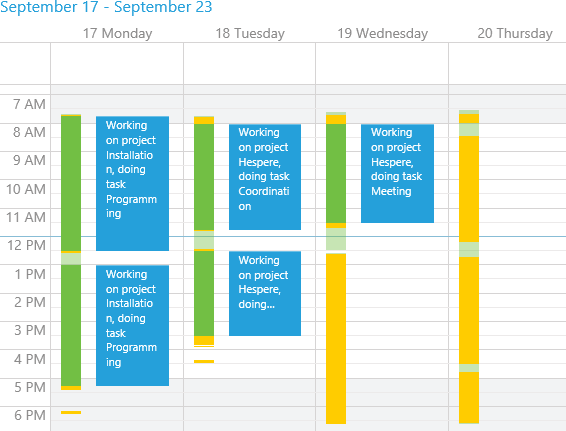
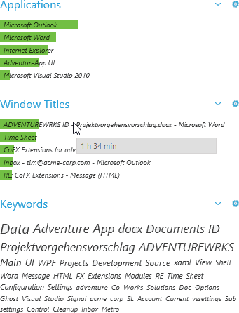
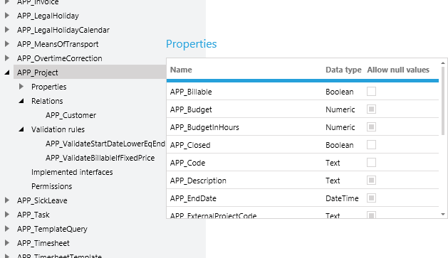

# Getting Started With Time Cockpit

## What Can Time Cockpit Do For You?

### Graphical Calendar

We want to make your life easier by providing a graphical calendar for gathering your time sheet entries. Switch between day, week, or month view depending on the level of details you need. The graphical visualization ensures that you will immediately recognize booking mistakes like missing time sheet entries or unwanted overlapping time sheet entries.

### Activity Tracking

The activity trackers help you to reconstruct the time you work on your PC. They automatically log what you are doing. Additionally you can import the call history from your phone if phone calls are relevant for your time sheet. As a developer connect time cockpit to your Microsoft Team Foundation Server to see when you checked in files and when changes happened to your work items. The graphical time sheet calendar visualizes this log and lets you transform activities into time sheet entries with a few mouse clicks.

### Extensibility

You know best how time tracking should work for you. Do you track per task or per project, or do you need to assign cost centres? We ship a data model that works for many smaller companies, but we allow you to tailor time cockpit to your needs. You can add new tables, complement existing tables with properties and relations and you can customize all lists and forms. There is a built-in scripting environment with IronPython and you can even access the time cockpit API with .NET.

