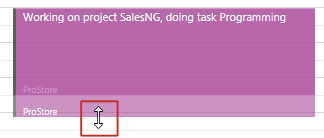
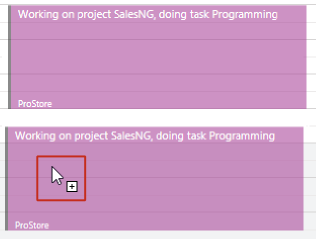

# Working With Time Sheet Entries

## Create

You can create time sheet entries in a number of ways:

- Double-click at the point in the calendar where your time sheet entry should begin. The time sheet entry form will be opened. The default begin time is the time you clicked.
- Double-click a Microsoft Office Outlook appointment (see Microsoft Office Outlook appointments).
- Click on **New booking** in the ribbon.
- Press **CTRL + I**.
- Press **CTRL + Shift + T**. You can configure this shortcut in the [signal tracker for notes](~/doc/signal-tracker/notes.md).
- Double-click an area in the signals (see [signals](signals.md)).
- Copy an existing time sheet entry.

## Change

You can change time sheet entries by the following ways:

- Double-click the time sheet entry that you want to change.
- Select a time sheet entry by clicking on it and click Edit booking in the ribbon.

The color and text of a time sheet entry in the calendar depend on your selected formatting profile. Please find more information on how you can configure your time sheet entries at Formatting Profiles.

You can change all details of a time sheet entry in the time sheet entry form. Begin and end time can also be modified in the time sheet calendar with the mouse. To change the begin or end time move the mouse pointer over the upper or lower border or the time sheet entry, click it, hold the mouse button pressed and move the mouse. To move a time sheet entry click the time sheet entry, hold the mouse button pressed and move the mouse.

> [!NOTE]
In the week view you can move or copy time sheet entries from one day to another by drag & drop.

## Copy

You cannot only move time sheet entries but also copy them with the mouse. Proceed exactly as described in moving time sheet entries but additionally press the CTRL key. A small + sign will be displayed next to the mouse pointer. When you release the mouse button (keep CTRL pressed) the time sheet entry will be copied to the specified time.

## Delete

You can delete time sheet entries by the following ways:

- Select a time sheet entry by clicking on it and press the DEL key.
- Select a time sheet entry by clicking on it and click on Delete booking in the ribbon.

## Actions in the Time Sheet Calendar

If you have reoccurring tasks that you want to accomplish in the time sheet calendar, you can create actions in time cockpit. Learn how to build a new action at [Actions](~/doc/scripting/actions.md). If the action does not need an input set, the action is always available. If the action takes one or more time sheet entries as input set, you can only call the action if you have selected one or more time sheet entries in the calendar.

