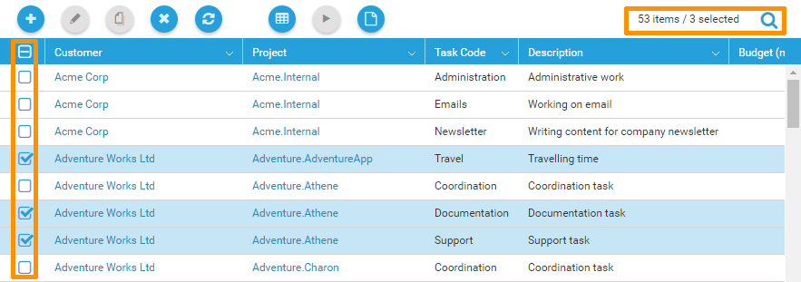

# March 2017

## Multi-Select in Grids with Checkboxes

In the new version, multiple rows in the grid can be selected with the checkbox on the left-hand side of each row. Right above the grid the number of total items and the number of selected items is shown. You can click the checkbox in the header to select or unselect all items.



Selected rows will not be lost if you are using the filter above the grid. You can search for some rows and add them to the selected rows. If you use the checkbox in the header row when a filter is applied, the filtered items will be added to the already selected rows.


## Performance Improvements for Forms

To validate entity objects before saving them, time cockpit is loading the entity object with all its relations to evaluate calculated properties, validation rules and permissions. Last year we have introduced a `IncludeClause` for `Form` definitions about a year ago ([read more ...](http://www.timecockpit.com/blog/2016/06/29/Whats-New-in-Version-July-2016#performance)). The `IncludeClause` helped us to improve the query performance by not loading unnecessary relations.

In the HTML5 client the `IncludeClause` is not needed anymore. We automatically evaluate all required relations for validating and saving entity objects.

## Select New With Queries and Python Scripts for Relation Cells

Relation cells in time cockpit are used to display a combo box in a form or in a filter for a list. There are a few different ways to specify the data source for relation cells. The following examples show a relation cell for projects in the timesheet entry form:

1. `<BoundCell Content="=Current.APP_Project" />`
Just specify the content for a BoundCell or RelationCell. Time cockpit automatically knows how to select all projects.
1. `<BoundCell Content="=Current.APP_Project" />` with a default relation list for the model entity `APP_Project`
The default relation list is specified in the model entity editor. 

1. `<RelationCell Content="=Current.APP_Project" List="USR_CustomProjectRelationList" />`
In this case the list to load data is explicitly specified in the relation cell.

For scenarios 2 and 3 the used list can load the data by:

- a `Select` query,
- a `Select New With` query or
- a Python script

`Select New With` queries and Python scripts are new in the HTML5 client this month. 

## Performance Improvements for Relation Cells

In most cases relation cells either do not use a list as data source or the list uses a Select query like the following as data source:

``` sql
From P In Project Select P
```

Select queries may generate a T-SQL statement that includes lots of joins and columns depending on calculated properties, validation rules and permissions of the affected model entity. The HTML5 client now parses such queries and generates a new `Select New With` query:

``` sql
From P In Project Select New With { .ObjectUuid = P.ProjectUuid, .Text = P.Fullname }
```

The new query only needs to select two columns from the database which may improve the time for selecting combo box values a lot for model entities with lots of properties and relations.